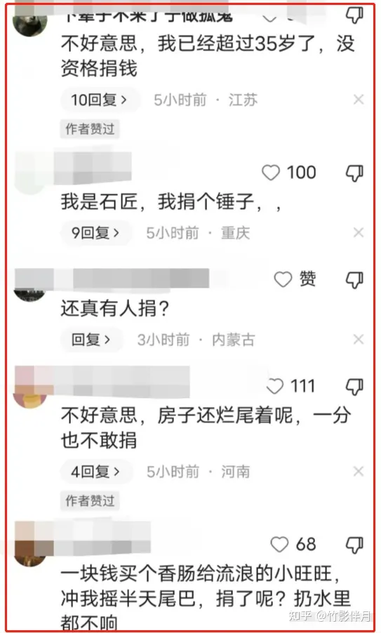

<https://www.zhihu.com/question/615616927/answer/3156010083>

# 如何看待红十字会评论区沦陷这件事？

洪水无情，人间有情。但是最近两天红十字会评论区沦陷了。评论区各种意见都有。如何看待这件事情背后的意义？

## 这一次，被扒了个底朝天的北京红十字会，还会嘴硬到底吗？

## 01

一场罕见的特大暴雨，影响了京津冀地区，也影响了东北。

**暴雨过后，到处一片狼藉。**

当地人民群众的生命财产，遭受到了巨大的损失，多少人因为这次天灾，失去良田和家园。

有人刚装修好的家，还没来得及入住，就被洪水也淹没。

房主哭着说，不知道再回来是否还认识面目全非的家。

**很多店铺全部毁了，装修费用不可估量。**

有人搭上全部身价搞起养殖，办了养殖场，鱼苗成大了，这时却遇上这种灾害。

无疑，这场洪水，给这些养殖人带来灭顶之灾。

仓库的商品被浸湿，腐烂，毁于一旦。

农村房屋倒塌，导致很多人无家可归。

庄稼淹没，一年的收成都没有了。

家禽家畜，全部被淹死。

洪灾过后，很多大企业和明星都捐了款，出了大批的人力、物力，帮助灾区重建家园。

王宝强、赵丽颖、方琼、草帽姐等明星，就是自行购买了几大车的物资，亲自跟车送到了灾民的手里。

灾难面前，大家**众志成城，有钱出钱，有力出力。**

而这个时候，**北京红十字会**，不是打开红会的仓库和账户向外拨款、发放物资，而是在网上**公布捐款账号，鼓励人们捐款。**

有网友质疑红会这个时候召集捐款，是打着水灾的名义敛财，直言现在不是接受善款的时候。

## 02

十几年前，一个叫**郭美美的女孩**，在微博上的一系列炫富事件，将中国红十字会推到了风口浪尖。

在短短的几天时间里，郭美美这个名字，连同她**"红十字商会总经理”**的身份，不断地被人调侃，质疑与攻击。

而在事件的背后，人们更为关注的，则是与此次丑闻有千丝万缕关联的中国红十字会，无意间引爆的炸弹，已让公众对慈善组织的公信力产生诸多质疑。

其实，关于红十字协会的信任危机这一问题，郭美美事件并不是第一例。

2008年5月，汶川地震灾后重建时期就曾爆出中国红十字会用**1300万元购买1000顶帐篷**的丑闻；

2011年4月，上海市卢湾区红十字会一张数额**为9859元的餐饮发票**，在微博上被曝光，立即引起了网友的围观和质疑。

公款吃喝，百姓早已深恶痛绝。

更让公众愤怒的是：**“我捐的钱，竟然让你吃了”？**

## 03

所以，就在红十字会发起募捐的时候，很多网友有说**捐个锤子**的，有说自己**超过35岁没有资格捐**的，也有说**自己房子烂尾了没钱捐**的。

有人暗讽没有北京户口、没有捐款证没法捐的，还有网友说要捐个加油的。

还有人重提当年郭美美事件，想去红十字会上班的。

能看得出来，对于北京红会，网友不再感动地稀里糊涂、毫不犹豫就打开口袋捐款，取而代之的，是**冷嘲热讽。**

很多网友为了表达对红会的不满，**只捐一分钱。**

在面对无数人只捐1分钱的讽刺后，红会将最低捐款改成了**1块钱。**

他们明明知道大家捐1分是为了表达不满，可他们却直接把最低捐款额给改了，拒绝了这种不满，拒绝了**“恶意捐款”。**

## 04

在信任危机出现的时候，一则红会的薪酬表格被爆了出来，引起了网友的极大关注。

一份名为“工资和福利支出”的报告显示，这一项的费用高达**2612万**，而这仅仅是**51个人**的收入。

**这样算下来，每个员工的年收入也在42万左右。**

这份收入报告曝光后，网友评论区里一片哗然。

面对公众的质疑，中国红十字会总会也做出了回应，总结起来就是**原博主算错了。**

可能是玻璃心，不久，红会关闭了评论区。

可能是看到了汹涌的舆情，红会意识到必须得做点什么，不然这样下去，大家都不愿意捐款了。

于是，红会官方发布了一篇工作人员救援支持的照片。

**但这张照片，又引起了极大的争议。**

四个人，不仅衣服干净整洁，就连鞋子都是一尘不染。

**特别是右下角的那位**，小心翼翼，给人的感觉就是，生怕弄脏了他的鞋子，蹑手蹑脚的形态暴露了摆拍！

其实，月月要说的是，这哪是摆拍，这分明就是**超现实主义与形式主义**的又一部代表作。

## 05

一波未平，一波又起。

**又有网友曝光了红会采购物资，疑似存在猫腻。**

从曝光的捐赠物资明细表可以看出，捐赠者中只有**北京五木服装公司**一家，其余都是采购。

不得不说，这家公司真的好慷慨，一下子就捐献了价值超过一百万的服装。

从公布的采购账单中，我们可以看到，雨衣、雨鞋的单价为**74元，**短袖T恤**162元**，这个单价比超市和网上的高出了2-3倍。

甚至，7月份，在接近40度高温的天气里，居然还有西服西裤。

网友还挖出让人质疑的一点，就是这个五木服装公司的法人叫**季连旭**，而红会的常务理事会名单里，也有**季连旭**这个名字。

而物资采购的接收单位，就是季连旭公司的所在地。

为什么一个慈善组织的高层，会在灾害后高价采购自己公司的物资，然后又变成接收方接收回去？

这是左手进、右手出？

中国红十字会频遭舆论唾弃，当然不是郭美美一个人造成的，而是慢性中毒累积到一定程度之后的必然病变。

**有果必有因，信任不是一天建立的，也不是一天就能坍塌的**，并不是民众缺乏爱心，而是种种事件让大家寒了心。

公众能否恢复信心，取决于有关部门的决心和行动。

就目前情况来看，很多网友已经为中国红十字会重建公信力开出了药方。

概括起来，无非是三个方面：

**一是要公开透明廉洁高效**，所有账目和善款的使用情况要充分公开，以公开和透明打消公众的腐败猜想；

**二是要着力优化人才队伍**，通过队伍建设来提升专业性；

**三是要不断加强社会监督**，创造条件鼓励媒体监督和社会监督，以监督提升公信力。

当然，正如中国红十字会的负面形象，**不是一天两天形成的**，要重建中国红十字会和中国慈善的公信力，也绝非朝夕之功。

期待红十字会，**拿出整顿队伍的诚意和改革体制的决心**，让中国慈善更加成熟。

不然，就像刀郎歌词里唱的那样: **不管你咋样洗呀，那也是个脏东西。**

——END——

[发布于 2023-08-08 17:07](https://www.zhihu.com/question/615616927/answer/3156010083)・IP 属地河北
